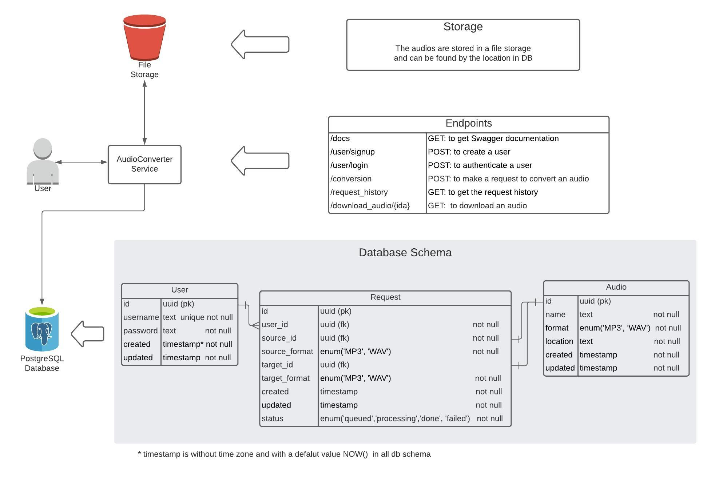

# Audio-converter

Audio-converter is a service that exposes a RESTful API to convert WAV to MP3 and vice versa. 

## Architecture Diagram

## DataBase

First, download PostgreSQL server of the version 13.x, install it on your system and run it.

To create a PostgreSQL user, database, schema and tables needed for the service,

* go to the scripts folder of this repository as `cd scripts/`;
* set execute permission on the script as `chmod +x create_db.sh`;
* run the script as `./create_db.sh` and enter postgres password and user's name and password when asked.

